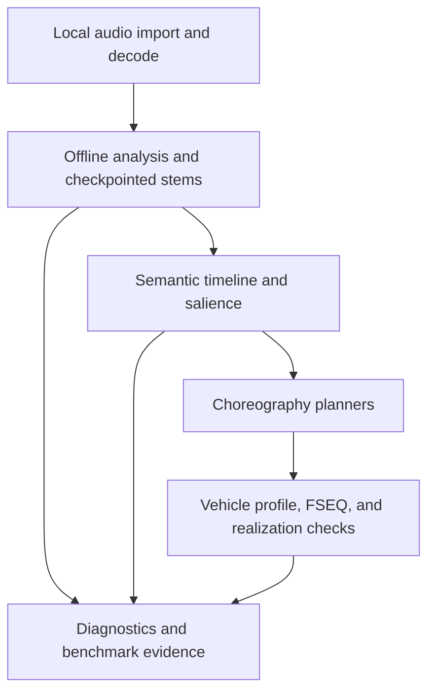

# LightForge architecture and production-readiness boundary

**Integration base:** `8406acb89faa10ea486e1ec822379d2e177eccbd`  
**Purpose:** describe what this revision implements, what its outputs mean, and
what evidence is still required before a production-release claim. This is an
implementation map, not a claim that every requirement in the long-term music
intelligence roadmap is already met.

## Status vocabulary

- **Enabled** means the normal offline application path loads and invokes the
  component.
- **Optional input** means the component accepts caller-supplied, validated
  evidence; it does not mean LightForge detects that evidence itself.
- **Diagnostic** means code or a test harness exists, but it is not release
  evidence until it is run against a configured locked corpus.
- **Not established** means this snapshot has neither the implementation nor
  the measurement needed to make the corresponding product claim.

## System boundary and data flow

The normal path is deliberately offline: the analysis README describes bundled
runtime graphs and no runtime downloads, keys, subscriptions, or remote
services. Original stereo PCM remains the exported soundtrack; analysis-derived
stems and events are supporting evidence, not replacements for the source
audio.

## Implemented-module map

| Concern | Enabled source surface | What is implemented at this snapshot | Boundary / current limit |
| --- | --- | --- | --- |
| Audio import and decode | `android/.../AudioImporter.java`, `WavConverter.java`, `web/analysis/wav-reader.js`, `dsp.js` | Android import/conversion and browser-worker audio reading feed the analysis stages. The analysis path retains an original-clock audio representation, while derived mono voice/accompaniment WAVs are private analysis artifacts. | Input decoding and conversion are trusted only after parser/shape checks. Do not infer universal codec support, a universal canonical PCM API, or measured import performance from this presence alone. |
| Feature reuse / FeatureStore | `feature-store.js`, `worker.js`, `wav-reader.js`, `dsp.js`, `work-store.js` | A content-addressed `FeatureStore` can persist and restore the worker's reusable deterministic rhythm payload. Its identity binds audio SHA-256, preprocessing version, model versions, and analysis configuration; Float32 payload shape/finite-value checks turn corruption or mismatch into a cache miss. | This is not yet a universal STFT/mel/chroma broker for every analyzer, and it does not change a miss into a weaker analysis path. Cache reuse needs locked-corpus equivalence and cost evidence before any speed claim. |
| Stem routing | `stem-routing.js`, `separator-deux.js`, `separator-mdx.js`, `stem-cache.js`, optional Android `NativeDeux` / `NativeMdxTask` bridge | A typed, provenance-aware routing contract records the actual legacy combined-vocal/accompaniment cache and can accept validated externally supplied semantic roles. Task routing prefers an eligible declared role, then uses only the explicit fallback policy. | This does not claim automatic four-stem separation. Lead/backing singers remain combined unless an external validated stem is supplied; the original mix remains authoritative when a stem conflicts with it. |
| Rhythm | `worker.js`, `dsp.js`, `rhythm-hierarchy.js`, bundled Beat This! assets | Rhythm/bar analysis runs in the staged worker; Studio and Balanced choose the documented full/compact Beat This! modes. An explicit `rhythmHierarchy` option can attach a bounded, evidence-validated beat/downbeat/bar/subdivision sidecar and is stripped from legacy in-memory restores when disabled. | Beat/downbeat/meter values are estimates with confidence, not annotations or ground truth. The sidecar does not replace the legacy beat grid; variable-tempo and irregular-meter quality requires locked-corpus evidence. |
| Vocal intelligence | `vocal.js`, `vocal-detail.js`, `game.js` | Singing/speech evidence, phrase/detail measurements, and GAME sung-note/pitch boundaries are assembled from the estimated vocal waveform. | This is not lyric transcription, word alignment, phoneme alignment, or singer/lead-backing separation. Confidence is relative evidence, not a calibrated probability. |
| Bass intelligence | `bass-notes.js`, worker bass stage | Low-register harmonic tracking produces bass-note/phrase estimates from the vocal-separated accompaniment mixture. | The default input is **not an isolated bass stem**: drums and other instruments remain. Bass output must retain its provenance and uncertainty. |
| Percussion | `dsp.js`, `semantic-timeline.js` input contract | The timeline can ingest explicit, classed external/manual `percussionAnalysis` evidence with provenance and strict event labels. A fresh rhythm pass may additionally request an experimental mix-feature estimate only with `enableEstimatedPercussionEvidence: true`; it requires local spectral/PCM attack agreement and propagates a low salience cap. | No dedicated shipped drum/percussion model is asserted here. The default path does not add labelled mix estimates. Opt-in estimates are marked as mixture-derived, remain below primary salience, and must not be described as isolated drums. |
| Semantic music timeline | `semantic-timeline.js`, worker `ensureSemanticTimeline` | The worker builds and validates one semantic timeline after analysis, carrying event time/span, semantic source, confidence, and relationships where supported. | It is a normalized interpretation layer, not an annotation oracle. Invalid supplied evidence is rejected rather than silently repaired into musical facts. |
| Salience | `salience.js`, worker `ensureMusicSalience` | A deterministic salience result is built from a valid semantic timeline and validated before use. | Tiering ranks the available evidence; it cannot compensate for missing drum labels, unavailable lyrics, or an uncertain stem. Its musical effectiveness needs corpus and perceptual review. |
| Recurrence motifs | `recurrence.js` | A standalone, bounded sidecar can derive generic motif identities from validated semantic-timeline/section evidence, canonicalizes identity assignment, and fails closed on corrupt frame evidence. | It is not loaded into the worker or planner by default, assigns no conventional song labels, and does not emit vehicle commands. Its musical usefulness requires corpus review before any optional integration. |
| Choreography | `music-cues.js`, `light-planner.js`, `movement-planner.js`, `show-engine.js`, `semantic-choreography.js`, `choreography-quality.js`, `sync-review.js` | Planners turn music context into light/movement plans, then `ShowEngine` paints deterministic FSEQ frames for identical input/settings/seed. Validated timeline/salience scheduling and semantic collision allocation are explicit opt-ins; absent or disabled settings retain the legacy planner. | Quality sidecars are read-only diagnostics; they do not prove that the source music detector was correct or that a human prefers the show. Semantic input alone does not enable choreography changes. |
| Collision accounting | `light-planner.js`, `show-engine.js`, `sync-review.js` | Final synchronization reporting separates raw candidate rejection from recorded high-salience rescue and unresolved/loss accounting. In explicit semantic-allocation mode, an entirely blocked high-salience target may use only a configured, available, non-conflicting fallback group at the same timing; otherwise it is recorded as suppressed. | A low reported loss is not proof of musical correctness. Fallbacks are never inferred, do not replace accepted commands, and have no effect in default mode. Missing planner metadata makes some conflict assessments unassessed rather than silently successful. |
| Vehicle realization | `vehicle-profile.js`, `movement-planner.js`, `show-engine.js` | The North American 2025 Model 3 Highland profile defines the known channel/output contract. The engine validates and emits uncompressed 200-channel FSEQ v2.0 at 15 or 20 ms frames. | Default closure travel values are conservative planning envelopes, not Tesla measurements. Vehicle motion, photometry, thermal behavior, and Dance cadence remain outside the software's control. |
| Perceptual timing | `vehicle-profile.js`, `movement-planner.js`, `sync-review.js` | An explicit local timing-calibration record can carry output latency, minimum duration, repeat interval, and conservative travel-envelope information. Movement planning records target/command/arrival intent. | No calibration is assumed by default. Light/RGB timing metadata is retained as evidence until an output-specific realization path consumes it; this revision does not establish real-vehicle perceptual synchronization. |
| Cache and recovery | `work-store.js`, `stem-cache.js`, `feature-store.js`, `analyzer.js` | OPFS-backed stage/passages checkpoints, atomic writes, checksums, cancellation, and resumable staged analysis are enabled. Stem completion markers protect restoration before downstream use; the FeatureStore separately fences reusable rhythm features by content identity. | Cache is disposable and cannot be the export source of truth. A cache hit is not a speed claim; cache equivalence and cost still need controlled measurement. |
| Analysis scheduling | `scheduler.js`, `analyzer.js` | FIFO admission permits one heavy analysis pipeline in a document, with an optional origin-wide Web Locks lease and cancellation-safe release. | This is a deliberate capacity-one safety coordinator, not a measured CPU/GPU/RAM-aware parallel DAG scheduler. It does not claim concurrent model execution or lower end-to-end runtime. |
| Diagnostics, benchmark, and gate | `telemetry.js`, `analysis-performance.cjs`, `analysis_benchmark_contract.py`, `locked_benchmark_runner.py`, `performance_quality_gate.py`, `differential_analysis.py`, release evidence verifiers | Machine-readable stage diagnostics, a bounded `analysis.performance` receipt projection (per-stage timing/restoration, cache/profile summaries, total wall time), contract validation, locked-corpus aggregation, baseline/candidate pairing, and differential tooling exist. Release verification supports immutable local receipt pins and a CI-only nonce-bound regeneration path for MDX/downstream/profile evidence. | The timing projection is measurement only: it has no performance threshold and a single CI observation is not a baseline/candidate result. The committed policy contains `__configure_locked_corpus__`; it is intentionally not release evidence. A redacted template and passing unit tests do not equal a licensed corpus, a benchmark result, or a quality pass. |

## Trust boundaries

1. **Audio and caller data.** Audio files, object URLs, caller options, manual
   cues, and optional percussion evidence are untrusted input. Parser,
   duration, finite-number, event-label, and timeline validation decide whether
   they can enter the pipeline. Unsupported/malformed evidence is discarded or
   fails explicitly; it must not be converted into a plausible musical event.

2. **Model assets versus musical truth.** The analysis runtime bundles pinned
   model assets and an asset manifest. Asset integrity and offline availability
   do not make a model output ground truth. Separation, beat, vocal, bass, and
   structural values remain estimates with provenance and confidence.

3. **Original mix versus separated material.** Estimated voice/accompaniment
   signals improve task routing but can contain artifacts. The original mix is
   retained, and neither a stem nor its transient energy may create a labelled
   event without the appropriate analyser or explicit evidence.

4. **Persistent cache versus fresh analysis.** OPFS records are private,
   checksum-bound, atomic checkpoints. A corrupt, stale, mismatched, or
   incomplete record is a cache miss, never a trusted analysis result. Cache
   recovery preserves work; it must not silently change musical output.

5. **Music understanding versus choreography.** Analysis emits musical
   evidence. Light and movement planners choose a visual realization under
   settings, output availability, and collision constraints. No individual
   detector is authorized to write arbitrary vehicle channels directly.

6. **Vehicle model versus vehicle behavior.** The profile is a software
   capability/command model. Any calibration is explicit and local. Preview,
   FSEQ validity, and predicted arrival timing do not prove physical Tesla
   timing, stroke cadence, safety, thermal behavior, or visual brightness.

7. **Diagnostics and release evidence.** Privacy-safe diagnostics should carry
   hashes, versions, metrics, and bounded warnings rather than raw audio,
   lyrics, project paths, or credentials. Benchmark data is trusted by the
   release gate only when corpus identity, provenance, controlled conditions,
   pair identity, and policy digest all match.

## Enabled paths versus optional or unproven paths

| State | Paths | Interpretation |
| --- | --- | --- |
| Enabled normal path | Offline staged analysis (`rhythm → separation → voice → bass`), semantic timeline/salience validation, deterministic ShowEngine/FSEQ generation, checkpoint/recovery, capacity-one admission | These are current application capabilities, subject to normal test/build verification. Their presence does not imply a performance or perceptual-quality result. |
| Optional integration | Native Deux/MDX execution supplied by Android bridges; explicit `percussionAnalysis`; explicit vehicle timing calibration; manually supplied cues | These run only with valid caller/integration evidence. They cannot be advertised as automatic detector coverage or calibrated vehicle behavior without separate evidence. |
| Diagnostic / release-gate tooling | Telemetry, benchmark contract, locked benchmark runner, performance-quality gate, differential analysis, native inference profiling | These establish a reproducible measurement mechanism. The shipped placeholder corpus policy means no current PASS or runtime-reduction conclusion follows from them. |
| Not established in this snapshot | Generic cross-analyzer spectral feature broker; reliable automatic four-stem/lead-backing separation; automatic classed drum detection; lyrics/word/phoneme alignment; adaptive compute equivalence; resource-aware parallel analysis DAG; measured Tesla perceptual latency; 75% end-to-end improvement | Treat these as roadmap or evidence gaps, not hidden capabilities. |

## Current profiling observation — not a benchmark

One cold CI run of the actual analyzer on a 2-core / 8 GiB worker recorded
**400.3 s** end-to-end: separation **359.37 s**, voice **36.08 s**, rhythm
**4.07 s**, and bass **0.225 s**. This is retained through the
`analysis.performance` projection as a bottleneck observation only. It is not
a locked-corpus baseline/candidate comparison, does not establish a speedup,
and makes **no 75% runtime-reduction claim**.

## Hard production-release blockers

This revision must not be described as production-release certified until all
of the following have evidence in the release record.

1. **Configure and lock the corpus.** Replace the placeholder
   `__configure_locked_corpus__` policy entry with a reviewed, licensed private
   corpus manifest containing stable audio identities/hashes and required
   tracks. The audio itself should remain outside the repository.

2. **Collect controlled paired measurements.** Run baseline and candidate on
   the same audio identity, model/preprocessing/configuration, hardware,
   runtime/accelerator, seed, thermal profile, and cache mode. The current
   policy requires at least five paired runs for every required track.

3. **Pass the fail-closed quality gate.** Every critical metric must be
   improved or statistically equivalent under the committed tolerance. This
   includes vocal alignment, beat/downbeat accuracy, bass events, structural
   recall, high-salience coverage, perceptual synchronization, actuator
   feasibility, and high-salience collision loss. Inspect the differential
   report for removed or shifted high-salience events.

4. **Establish the performance result.** There is no verified baseline runtime,
   optimized runtime, or percentage reduction in this source snapshot. The
   75% objective can be claimed only when the configured gate reports the
   required per-track runtime reduction without a quality/reliability failure;
   a partial pass is not a production-ready performance claim.

5. **Validate on representative music and reviewed goldens.** Preserve approved
   timelines, maps, plans, FSEQ characteristics, and diagnostic reports for a
   diverse licensed corpus. Resolve any material differential or human blind
   A/B preference against the candidate before enabling an optimization by
   default.

6. **Complete Android and vehicle validation.** Produce a clean signed release
   build; test cancellation/resume, corruption recovery, low-memory behavior,
   FSEQ import, output masks, and safe failure on target devices. Validate the
   specific vehicle profile/calibration on real hardware before making a
   latency, travel, or perceptual-sync claim.

7. **Close known capability gaps or constrain claims.** Do not market estimated
   accompaniment bass as isolated bass, optional percussion as automatic drum
   recognition, vocal-note analysis as lyric alignment, or planner envelopes
   as Tesla calibration. Any remaining limitation needs an explicit user-facing
   fallback and diagnostic warning.

8. **Regenerate same-session real-model receipts in CI.** When worker,
   separation, or profile sources change, the release job must mint one
   `LIGHTFORGE_EVIDENCE_SESSION`, run native MDX comparison before downstream
   analysis, run the profile proof, and verify all three generated receipts
   under that same nonce. A local/no-session check retains immutable MDX and
   downstream pins; a changed native profile requires its complete paired
   proof. Historical timestamps or receipt hashes must never be rewritten as
   a substitute for the fresh run.

## Current release statement

This integration candidate extends the `8406acb` base with bounded,
opt-in sidecars, deterministic sequence safeguards, cache contracts, and
fail-closed evidence plumbing. It is **not yet supported by a configured
locked corpus and measured baseline/candidate release result**, and therefore
must not claim production readiness, a quality-regression-free optimization,
or a 75% runtime reduction.
