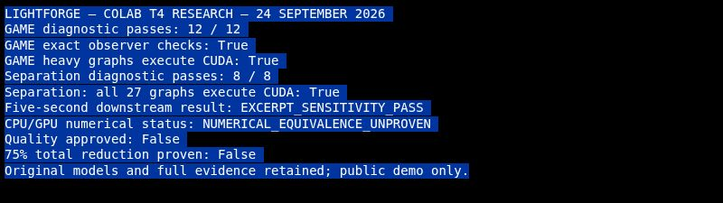

# Colab GPU research — September 24, 2026

Colab sign-in and free Tesla T4 execution are working. The original public APK,
model graphs and public demo were recovered and checked before these runs.
Complete archives, source bindings and independent audits are retained here.
Application payload, release policy and signing identity were not changed.

| Experiment | Verified result | Limit |
| --- | --- | --- |
| [Complete 64-second GAME source](game-full-source/RESULTS.md) | Six complete passes; 24 exact observer comparisons; all 98 final production notes match and checkpoint resume reproduces them | Public mixture, GAME only; raw CPU/GPU tensors and unrounded pitches differ; no admitted speed ratio |
| [GAME deterministic CUDA](game-deterministic/README.md) | Twelve complete passes; all eight exact observer checks pass; heavy CUDA computation confirmed | One 14-second mixture passage; CPU/GPU raw outputs differ |
| [Deux separation](deux-t4/README.md) | Eight complete passes; four exact observer checks; all 27 graphs compute on CUDA | One original separation passage; CPU/GPU waveform bytes differ |
| [Downstream replay](deux-downstream/README.md) | Existing five-second sensitivity rules pass; final transcription and fused vocals match exactly | Raw checkpoints differ; this does not test CUDA GAME inside the complete vocal stage |

The GAME candidate adds an explicit research-only deterministic-compute option
and keeps the two unchanged conversion graphs on CPU. The prior
[blocked run](initial-blocked/README.md), [observer-rejected run](game-heavy-only/README.md)
and [repeatability screen](game-repeatability/README.md) remain available so the
successful configuration cannot erase contrary evidence.

These results support continuing with the original models on one GPU worker
for both expensive stages. They establish neither general musical equivalence
nor a 75% reduction in complete analysis time. Repeated benchmark ratios remain
withheld under the unchanged experiment gates. Full-song consumer integration,
representative source-bound quality evaluation and complete elapsed-time
measurement—including transfer and startup—remain necessary.

The full-source run is independently verified from its downloaded raw archive,
including all six passage windows and actual production stitching. The
[setup-cost analysis](session-overhead/README.md) motivates a bounded
[session reuse candidate](session-overhead/GAME_SESSION_REUSE.md); it has source
tests and lifecycle review but has **not** been executed or qualified. The
[integration handoff](game-full-source/NEXT_INTEGRATED_STAGE.md) identifies the
remaining complete separation-to-vocal pipeline and the first-passage evidence
that can be reused without pretending it covers the missing passages.

The [next quality-gate document](NEXT_QUALITY_GATE.md) identifies the approved
corpus/policy bundle that is missing from this checkout and the public assets
that can support further development. The checked-in template and historical
engineering drafts are not approval. See the [overall acceleration plan](../../../docs/75_PERCENT_ACCELERATION_PLAN.md)
for the complete-time budget and experiment order.

