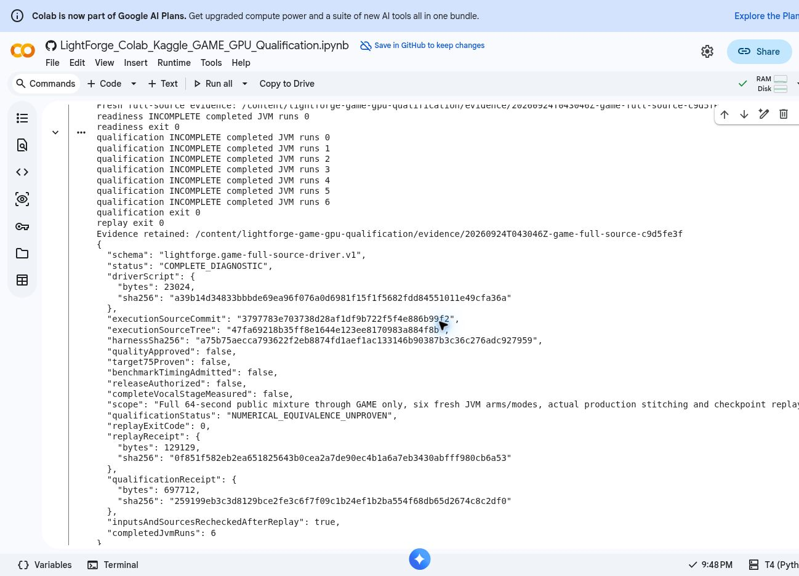

# Complete-source GAME result — September 24, 2026

The original GAME models completed the entire 64-second public demo on Colab's
free Tesla T4. Independent verification of the downloaded archive reproduced
the actual production stitching and checkpoint replay. The CPU and CUDA arms
produce the same **98 final production notes**. This extends the previous
single-passage experiment; it is not the complete separated-vocal pipeline.

## What passed

| Check | Independently verified result |
| --- | --- |
| Complete input | All 2,822,400 Float32 samples independently rederived from the pinned public WAV |
| Production schedule | Six original windows, unchanged language and seeds; all eight diffusion steps |
| Runs | CPU/ALL and deterministic heavy-only CUDA/BASIC, each in fresh plain, captured and profiled JVMs |
| Observer comparisons | All 24 exact comparisons pass across the six passages |
| GPU placement | Encoder, segmenter and estimator perform substantive CUDA arithmetic in every passage; unchanged duration/boundary conversion graphs remain on CPU |
| Raw CPU/CUDA comparison | 13 of 16 tensors per passage are byte-identical; encoder features and estimator scores differ |
| Raw notes | Same passage note counts and exact start/end boundaries; maximum accepted-note pitch difference is 0.0000152587890625 MIDI |
| Actual production consumer | Exact 98-note final transcription after unchanged stitching, clipping, sorting and rounding |
| Recovery | Native checkpoint resume reproduces the final result exactly; raw cross-provider note differences remain retained |
| Independent replay | Recomputed comparison JSON is byte-identical to the archived comparison |

There is no new tolerance. The collector remains
`NUMERICAL_EQUIVALENCE_UNPROVEN`; exact rounded production output does not erase
raw differences or approve general musical quality. Raw estimator scores differ
by up to 0.00006866455078125, including scores outside accepted notes; all remain
retained. The verifier's
`modelInferenceExecuted: false` describes the local **verification**, which
rechecks existing tensors/traces and executes production JavaScript replay.
The six full-source JVM runs occurred in Colab and remain bound in the archive.

## Diagnostic elapsed times

| Plain arm, one run each | Source-run wall | Process wall including startup and inspection |
| --- | ---: | ---: |
| CPU/ALL | 182.560606 s | 182.819029 s |
| Tesla T4 CUDA/BASIC | 42.357847 s | 42.821936 s |

These are single diagnostic observations, not admitted benchmark samples or a
speedup ratio. The source-run interval includes engine creation, the six
passages, per-passage hashing/receipts and original session retirement. It
excludes the later production replay, initial asset downloads, full separation,
the other vocal models, companion transport and the rest of analysis. Captured
and profiled runs are separate observers, not repeat timing samples. Every
timing-eligibility and 75% approval flag remains false.

The baseline still creates and retires five sessions per passage. The
[setup-cost analysis](../session-overhead/README.md) and isolated
[reuse candidate](../session-overhead/GAME_SESSION_REUSE.md) define the next
optimization experiment. The candidate has not run and has no performance or
JNI lifecycle qualification. The [integration handoff](NEXT_INTEGRATED_STAGE.md)
maps the missing complete Deux, stem-cache and separated-vocal stages.

## Retained evidence

| Run | Archive bytes | SHA-256 | Result |
| --- | ---: | --- | --- |
| `20260924T042656Z-game-full-source-952fe51b` | 7,709,572 | `c31fc60e69f173bce2052666a7db883482fa63ad828aeb9c0515fc15f83109b5` | Original reader rejected a single 64-second read before inference; independently verified partial evidence |
| `20260924T043046Z-game-full-source-c9d5fe3f` | 91,197,345 | `01a45c1ee5eeb7b63e26b316589673903bf362ccf99863b156f726c8543e1670` | Complete diagnostic; independent verification passes |

The correction used two consecutive 32-second reads through the actual
production reader, respecting its unchanged 40-second bound. No production
guard, input sample or model was changed. Both attempts remain reconstructible
under [input-proof-blocked](input-proof-blocked/) and [full-demo](full-demo/).
Their `reconstruct_archive.py` scripts verify every part and the whole archive
before creating a new output file. Run `verify_evidence.py` with that archive's
declared size and SHA-256, a new output directory outside Git, and this repository.

Execution source: `3797783e703738d28af1df9b722f5f4e886b99f2`, tree
`47fa69218b35ff8e1644e123ee8170983a884f8b`. Corrected driver SHA-256:
`a39b14d34833bbbde69ea96f076a0d6981f15f1f5682fdd84551011e49cfa36a`.
The source, actual parent setup receipts, native runtime identity, raw tensors,
provider traces and failed attempt are retained. Archives contain public-demo
research evidence, not APKs, model binaries, credentials or private audio.

No application source, protected release policy, signing material or published
version was changed. Android and physical-device performance, the full vocal
stage, general quality and the 75% complete-analysis target remain unproven.

